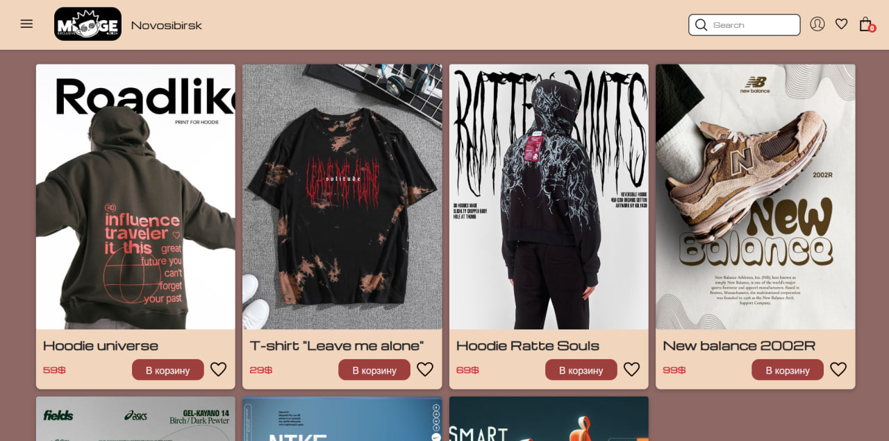

  <h1>Вот вы здесь 👋</h1>
  
 

- 👨‍💻 Разрабатываю Asp Web API приложения;
- 🔭 Сейчас разрабатываю приложение для онлайн магазина с вёрсткой сайта и подключение Web API к нему;
  
- 🌱 Изучаю новые интсрументы и технологии;
- Связать можно тут 👉 [Telegram](https://t.me/Andr0medaaa)

---
### Моя статистика 🔥

  
   
  
  

---

  
  
  
  &nbsp;
  &nbsp;
  
  
  
  
  
  

